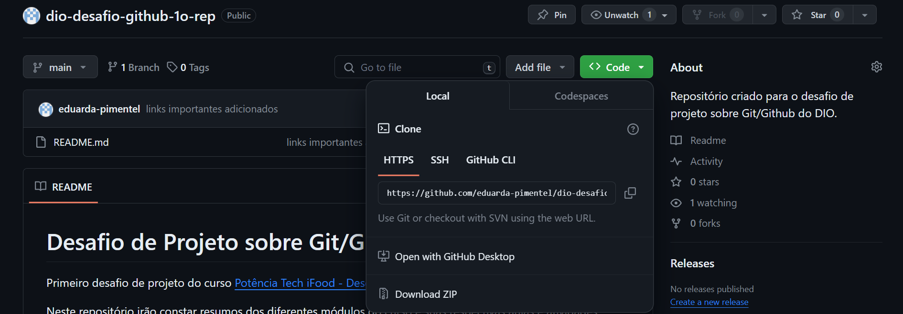
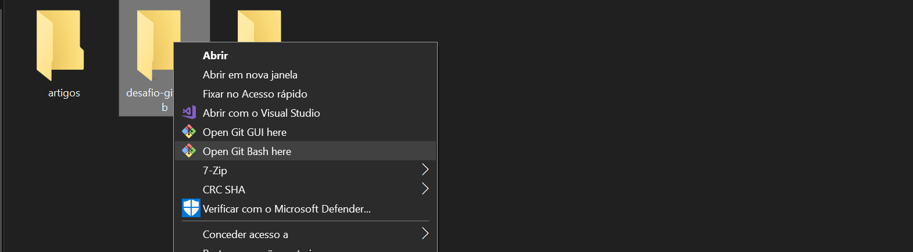
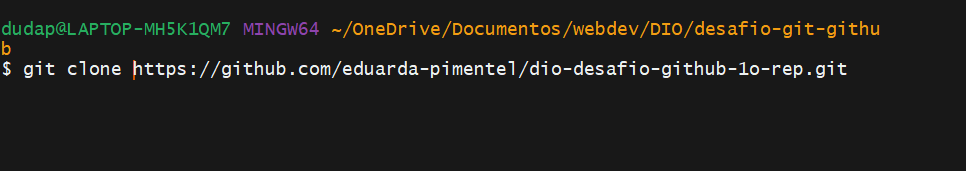

# :computer: Como clonar um repositório passo a passo

Resumo de como trabalhar com repositórios já existentes (assumindo que o Git já está instalado certinho e que você já tem uma conta no GitHub)

### 1. Encontrar um repositório no GitHub e copiar a sua URL

Este link se encontra na aba "Code", no topo do repositório.

### 2. Abrir o Git Bash dentro do diretório de trabalho atual

Ou seja, abrir o Git Bash na pasta onde você quer salvar o repositório clonado.

### 3. Na command line, inserir git clone + a URL copiada e dar ENTER

# :computer: Como linkar o seu repositório local a um repositório remoto

### 1. Criar uma pasta de trabalho no seu computador
É esta pasta que funcionará como o seu repositório local.

### 2. Abrir o Git Bash na pasta e utilizar o comando git init
Este comando irá de fato inicializar a pasta como um repositório git.

### 3. Criar um repositório no GitHub/copiar o link de um repositório já existente
Exatamente como no passo 1 da seção anterior.

### 4. Usar o comando git remote add origin + URL copiada
Assim, o git saberá que este é o repositório remoto onde deve fazer os push & pull.

# :floppy_disk: Como salvar suas alterações (repositório local &  remoto)

Uma vez feitas alterações no repositório local (ex: criar pastas, criar arquivos, editar arquivos), é preciso seguir uma série de passos antes de enviar estas mudanças para o repositório local. Isto é bom, porque enforça um maior controle sobre o fluxo de trabalho.

### 1. Verificar o status da árvore de trabalhos
Comando: git status.

Vai mostrar que arquivos ainda não foram adicionados à árvore de trabalhos, marcados como __untracked__ (ou seja, arquivos que ainda não estão marcados para serem acompanhados)

### 2. Adicionar os arquivos desejados à árvore de trabalhos
Comando: git add (nome do arquivo)
ou, para adicionar todos os arquivos que ainda estão untracked.
Comando: git add .
Para verificar se foi tudo adicionado corretamente, repetir o passo 1.

### 3. Comittar as alterações
Comando: git commit
 :exclamation: __Boa prática__: Para saber quais alterações foram feitas (ou seja, o que significa aquele commit), devemos enviar o commit com uma mensagem sucinta que descreve o commit.
 Para isso, usamos o comando:

 git commit -m "mensagem aqui"

 :exclamation: __Atenção__: Com esta ação, as alterações apenas foram salvas no repositório local. Ou seja, não vão aparecer ainda no GitHub.

 ### 4. Fazer push do commit no repositório remoto
 Comando: git push (ou git push -u origin main para garantir a ligação com o repositório remoto)

 &rarr; Caso não queira fazer push para o main
 Comando: git commit push -u origin \<branch name\>

## :link: Links úteis

[Free Code Camp: Git best practices](https://www.freecodecamp.org/news/how-to-use-git-best-practices-for-beginners/)